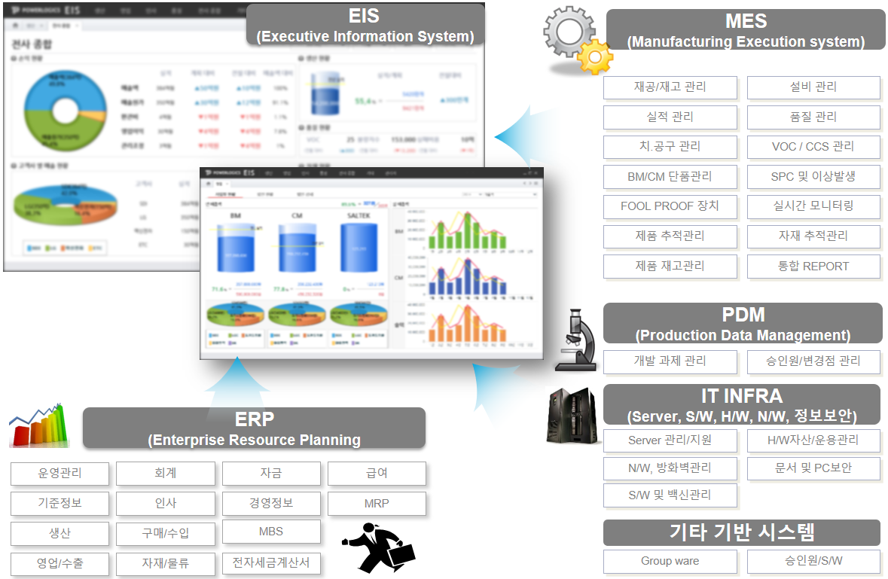

# 자기소개(김병근)

 

 
 ## 나에게 대학원이란? 
  - 개인적으로는 빅데이터, 인공지능에 대한 일반인들이 아는 정도로만 알고 있었을 뿐,
    실무에 있는 당사자로서 어떻게 접근해야할지 막연할 뿐이였습니다.
  - 회사적으로 현 수준은 단위 공정자동화에 국한된 내용들만 구축하고 있습니다.
    단기적 효과활동만 하여 장기적 경쟁에 한계점이 발생할 것으로 보입니다.
  - 대학원 교육과정의 전체가 관심이 있다고 할 수 도 없을 뿐더러, 모두 이해하고 활용할 수 는 없겠지만, 
    스마트팩토리의 요소기술들의 개념과 체험을 한다는 그 '한 걸음'자체에 의미가 상당히 있을 것으로 생각됩니다
  - 어떻게 도입해야할지 가능은 한 것인지 적당한 시기는 언제인지 어떤 사업분야에 활용해야 할지를.... 남은 2년여 상당히 기대가 됩니다 
  
  - ps. 특히나 지난 금요일 이교수님께서 github 나머지 공부를 시켜주실때 하신말씀이 많이 와닿습니다
    저조차도 프로그램을 해오던 사람으로써 모든게 생소하고, 기존 개념에 끼워맞추면서 이해할려다 보니 여러모로 쉽지는 않지만... 열심히 해보겠습니다
    
 ## 근무 회사
   - 2005~2010: MES(Manufacturing Excution System) 개발업체 ........ 개발자
   - 2010~2020 현재: 청주소재 제조기업(www.powerlogics.kr) 전략정보팀 근무 중 ............ MES/PDM 프로젝트 기획/구축/운영 및 일부 개발      

 ## Contacts
- 이메일 : [김병근:mail](mailto:bkkim@cbnu.ac.kr)
 
 ## 역량
 ### 주요업무 기술

  

  - 
 

 ### 개발언어 기술
  - Application: C#(상), Xplatform(중)
  - Web Application: Asp.Net(중)
  - DB: (SQL/Programming/Admin) Oracle(상), MS-SQL(중)

#### 학과 GitHub Site
- `2020-10` [어프렌티스 프로젝트](https://github.com/ByeongKeun/industrial-AI/tree/master/projects/어프렌티스-프로젝트): 문제해결방법론 교육 및 프로젝트 준비
- `2020-10` [산업 빅데이터 분석 실제](https://github.com/ByeongKeun/industrial-AI/tree/master/projects/산업-빅데이터분석-실제): 파이썬 패키지를 사용한 빅데이터 분석 및 시각화 기술 학습
- `2020-10` [기계학습](https://github.com/ByeongKeun/industrial-AI/tree/master/programming/기계학습): PCA, SVM, HMM 등 기계학습 관련 알고리즘 구현
- `2020-10` [네트워크-통신](https://github.com/ByeongKeun/industrial-AI/tree/master/programming/네트워크-통신): IoT 관련 네트워크 프로그래밍
- `2020-10` [딥러닝](https://github.com/ByeongKeun/industrial-AI/tree/master/programming/딥러닝): MLP, CNN, RNN 등 딥러닝 활용 프로그래밍
- `2020-10` [빅데이터분석](https://github.com/ByeongKeun/industrial-AI/tree/master/programming/빅데이터분석): 빅데이터 분석 알고리즘 구현
- `2020-10` [GitHub이용및포트폴리오작성자료](https://github.com/Bessesian/industrial-AI/tree/master/Education): 포트폴리오 관리 자료
